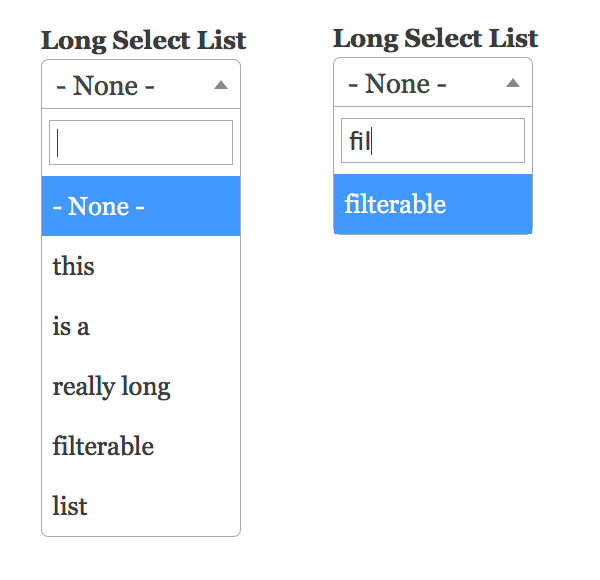

#Webform Select2

This module adds select2 widget to all select elements in a webform.

##Installation and Usage

To use it, install this module and download [select2](http://select2.github.io) 
to the `/libraries` folder; ensure its directory is named "select2" when you 
extract it.

To opt-out a particular select element from the form, edit the webform component 
and add "no-select2" as a css class.

##License

This project is GPL v2 software. See the LICENSE.txt file in this directory for
complete text.

##Current Maintainers

- [Laryn Kragt Bakker](https://github.com/laryn) - [CEDC.org](https://cedc.org)

##Credits

 - This module was ported to Backdrop by 
   [Laryn Kragt Bakker](https://github.com/laryn) -
   [CEDC.org](https://cedc.org).
 - This module was originally created 
   [for Drupal](https://github.com/colemanw/webform_select2) by 
   [Coleman Watts](https://github.com/colemanw)
